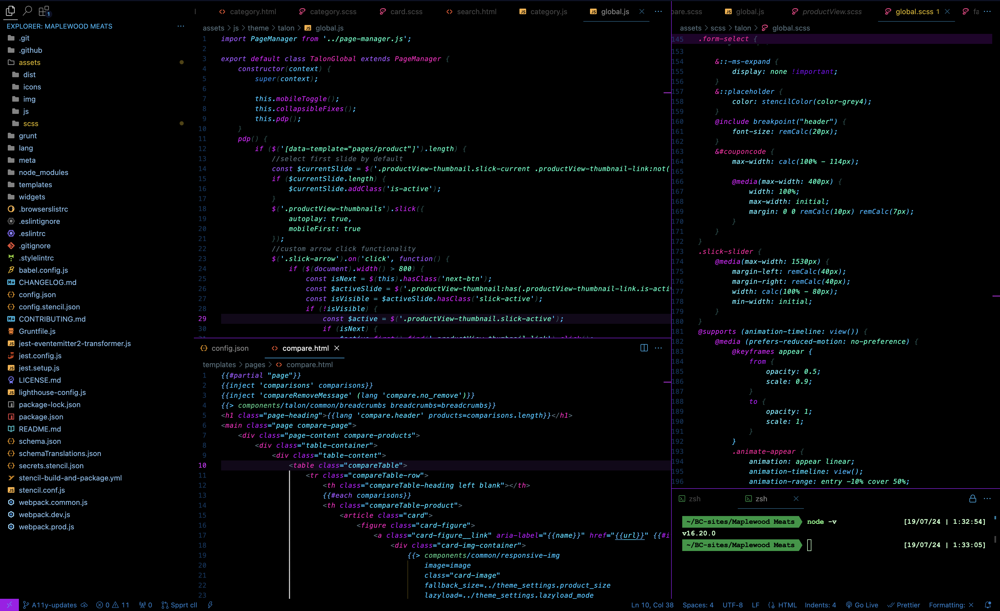

# Neon Future README

-I also used the APC Customize and Bearded Icons extensions with these settings:
{
	"editor.fontFamily": "\"Fira Code\",\"mononoki Nerd Font\", Menlo, Monaco, 'Courier New', monospace",
	"editor.cursorSmoothCaretAnimation": "on",
	"editor.cursorBlinking": "expand",
	"workbench.iconTheme": "bearded-icons",
    "workbench.layoutControl.enabled": false,
	"window.commandCenter": false,
	"window.titleBarStyle": "native",
	"window.customTitleBarVisibility": "never",
	"apc.electron": {
		"trafficLightPosition": {
			"x": 7,
			"y": 5
		},
		"backgroundColor": "rgba(123, 123, 123, 0.5)",
		"frame": false,
		"titleBarStyle": "hidden",
		"vibrancy": "ultra-dark",
		"opacity": 0.98,
		"visualEffectState": "active"
	},
	"apc.header": {
		"height": 37
	},
	"apc.sidebar.titlebar": {
		"height": 20,
		"fontSize": 12
	},
	"apc.activityBar": {
		"size": 40,
		"itemSize": 40,
		"itemMargin": 0,
		"position": "top"
	}
}

## Working with Markdown

You can author your README using Visual Studio Code. Here are some useful editor keyboard shortcuts:

* Split the editor (`Cmd+\` on macOS or `Ctrl+\` on Windows and Linux).
* Toggle preview (`Shift+Cmd+V` on macOS or `Shift+Ctrl+V` on Windows and Linux).
* Press `Ctrl+Space` (Windows, Linux, macOS) to see a list of Markdown snippets.

## For more information

* [Visual Studio Code's Markdown Support](http://code.visualstudio.com/docs/languages/markdown)
* [Markdown Syntax Reference](https://help.github.com/articles/markdown-basics/)

**Enjoy!**