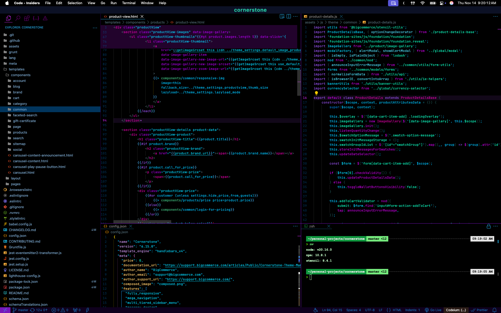

# Neon Future README

# Setup
1. Include these in your settings.json configuration
	- {
		"window.title": "${rootName}",
		"workbench.layoutControl.enabled": false,
		"window.commandCenter": false,
		"editor.stickyScroll.enabled": true,
		"editor.fontFamily": "JetBrains Mono, Menlo, Monaco, 'Courier New', monospace",
		"editor.cursorSmoothCaretAnimation": "on",
		"editor.cursorBlinking": "expand",
		"workbench.iconTheme": "bearded-icons",
		"window.density.editorTabHeight": "compact",
		"workbench.activityBar.iconClickBehavior": "toggle",
		"workbench.activityBar.location": "top",
		"vscode_custom_css.imports": ["file:///<path-to-custom-css>/vscode-custom.css"]
	}

2. Install vscode extensions:
	- [Custom CSS and JS Loader](https://marketplace.visualstudio.com/items?itemName=be5invis.vscode-custom-css)
	- [Bearded Icons](https://marketplace.visualstudio.com/items?itemName=BeardedBear.beardedicons) (optional)

3. Custom CSS and JS Loader
	- Use these styles in your vscode-custom.css: 
		- ".monaco-workbench .pane-composite-part>.header-or-footer { padding-left: 15px !important; } .custom-sidebar-titlebar .sidebar .composite.title { padding-left: 0 !important;padding-right: 0 !important; } .custom-sidebar-titlebar .sidebar .composite.title h2 { font-weight:bold;color:#1cf7dd !important; } .monaco-workbench .part.statusbar>.items-container>.statusbar-item.left.first-visible-item { padding-left: 0 !important; } .statusbar #status .host { display: block !important; width: 40px;  } .statusbar #status .host .codicon { margin: 0 auto; } .mtki { font-style: initial !important; } .inline-title-bar:not(.horizontal-activitybar):not(.statusbar-top) .monaco-workbench.no-activity-bar:not(.sidebar-right):not(.fullscreen) .inline-titlebar-placeholder { padding-left: 0 !important; } .monaco-workbench .part.editor > .content .editor-group-container.empty.active { -webkit-app-region: drag; } .split-view-view:has(.titlebar) { z-index: 5; z-index: 1; top: 0; width: 100% !important; position: absolute !important;max-width: initial;height: 30px !important; display: block !important; } .split-view-view:has(.titlebar) .titlebar { height: 28px !important;width: 100% !important;background: #0c1125 !important; } .split-view-view:has(.titlebar) .titlebar .titlebar-left { display: none !important; } .split-view-view:has(.titlebar) .window-title { font-size: 20px !important; color: #25c5a2; font-weight: 700; letter-spacing: 1px; } .monaco-workbench .pane-composite-part>.header-or-footer>.composite-bar-container>.composite-bar>.monaco-action-bar .action-item .action-label { width: 25px !important;height: 25px;font-size: 21px; } .horizontal-activitybar .global-activity-actionbar { margin-left: 0 !important; position: absolute; right: 0; } .horizontal-activitybar .monaco-workbench .activitybar>.content>.composite-bar { width: calc(100% - 76px); } .horizontal-activitybar .monaco-workbench .activitybar .menubar, .custom-activitybar div.monaco-workbench div.activitybar>div.content div.monaco-action-bar ul.actions-container li.action-item a.action-label { width: 37px !important; } .horizontal-activitybar .monaco-workbench .activitybar>.content .monaco-action-bar .badge .badge-content { top: 4px !important; } .part.activitybar > .content { height: 48px !important; } .monaco-workbench .part.titlebar>.titlebar-container>.titlebar-right { display: none !important; } .monaco-workbench .part.titlebar>.titlebar-container>.titlebar-center { width: 100%; max-width: 100%; } .monaco-workbench .part.statusbar { background-color: rgba(107, 29, 176, 0.11) !important; } .monaco-workbench .part.sidebar>.header-or-footer>.composite-bar-container>.composite-bar>.monaco-action-bar .action-item .action-label:before, .monaco-workbench .part.sidebar>.title>.composite-bar-container>.composite-bar>.monaco-action-bar .action-item .action-label:before { left: 8px; } .monaco-workbench .part.editor>.content .editor-group-container>.title, body, .monaco-workbench .part.editor>.content .editor-group-container>.title .tabs-container>.tab:not(.active) { background-color: transparent !important; } body > .vs-dark { background: transparent !important; } .monaco-workbench .part.statusbar>.items-container>.statusbar-item.remote-kind { background-color: rgba(166, 33, 255, 0.69) !important; } .monaco-workbench .part.statusbar { background-color: rgba(127, 0, 239, 0.12) !important; } .monaco-workbench .sidebar, .monaco-workbench .auxiliarybar, .monaco-workbench .part.sidebar>.title, .monaco-list.list_id_1 .monaco-list-rows { background-color: transparent !important; } .monaco-workbench .sidebar { border-right: 1px solid #2e0155 !important; } footer.statusbar { background-color: #1f0031 !important; } .monaco-workbench .codicon[class*=codicon-] { font-size: 20px !important; } .monaco-workbench .pane-composite-part>.header-or-footer>.composite-bar-container>.composite-bar>.monaco-action-bar .action-item.icon, .monaco-workbench .pane-composite-part>.title>.composite-bar-container>.composite-bar>.monaco-action-bar .action-item.icon { padding: 0 3px; } .monaco-workbench .pane-composite-part>.header-or-footer>.composite-bar-container>.composite-bar>.monaco-action-bar .action-item.icon .action-label:not(.codicon), .monaco-workbench .pane-composite-part>.title>.composite-bar-container>.composite-bar>.monaco-action-bar .action-item.icon .action-label:not(.codicon) { mask-size: 26px !important; } .monaco-workbench { background-color: transparent !important; }"

## Working with Markdown

You can author your README using Visual Studio Code. Here are some useful editor keyboard shortcuts:

* Split the editor (`Cmd+\` on macOS or `Ctrl+\` on Windows and Linux).
* Toggle preview (`Shift+Cmd+V` on macOS or `Shift+Ctrl+V` on Windows and Linux).
* Press `Ctrl+Space` (Windows, Linux, macOS) to see a list of Markdown snippets.

## For more information

* [Visual Studio Code's Markdown Support](http://code.visualstudio.com/docs/languages/markdown)
* [Markdown Syntax Reference](https://help.github.com/articles/markdown-basics/)

**Enjoy!**